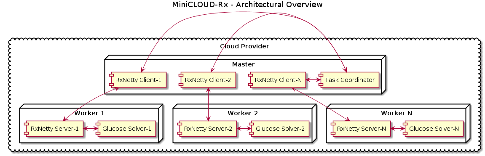

# Description
**MiniCLOUD-Rx** is a cloud based Satisfiability (SAT) solver powered by Netflix's [Rx](http://reactivex.io/) technology. It is deployable using kubernetes or docker (swarm). While **MiniCLOUD-Rx** is written in Java, it uses JNI bindings to make its calls to solvers thus preserving the speed inherit in the C++ they were written in.

# Architecture
In essence, the architecture of **MiniCLOUD-Rx** is a simple master-worker one as presented below:

### The worker
The base unit of **MiniCLOUD-Rx** is the well known [glucose SAT solver](https://github.com/wadoon/glucose). The JNI for it was generated using [JavaCPP](https://github.com/bytedeco/javacpp). These bindings are available [here](https://github.com/AE9999/javacpp-presets) for reuse in other projects.

The solver is exposed to the outside world using a reactive [RxNetty](https://github.com/ReactiveX/RxNetty) server. Reactive technology allows us to push: Solver Statistics, Learnt Clauses and (eventual) answers to interested 3rd parties, without having to employ a messaging framework such as RabbitMQ to do so.  Workers expose the following API:
  -  /api/ready : simply returns OK if server is up.
  -  /api/clauses: Adds posted clauses to the underlying solver.
  -  /api/answer: Given a set of assumptions, see if the asserted clauses are consistent under it. The answer is returned as a single Server Side Event.
  -  /api/reset: Deletes the used Glucose SAT solver and creates a new one.
  -  /api/learnts.stream: Returns a stream of Server Side Events that contain the learnt unit clauses by the worker.
  -  /api/stats.stream: Returns a stream of Stats of the underlying solver.
  - A WebSocket that can be used to push new unit clauses to the worker.

### The master
Workers are used by masters. A master is a spring-boot program to which job requests can be submitted. A job request contains: A) The Cnf to be solved. B) A list of partial assignments to be tested. C) An amount of solvers to use. Job requests can either be submitted through the command line at startup, or by POST request to the webserver. See the 'Job request submissions' section below for more info.

The master distributes the assignments to free workers. If any return SAT, the problem is classified as SAT, if all assignments return UNSAT, the problem is classified as UNSAT. Tips for generating efficitve lists of partial assignments can be found below under 'Generating efficient search space splittings' section

The workers a master needs are either: A) Deployed on the fly using docker. B) Already available on the local kubernets cluster, before launch. Problems that are submitted by command line by default use the docker approch. Problems submited through post request are by default handled using method 'B'. If nessecary this behavior can be overwritten using flags.

When using kubernets, workers should be deployed and ready, before deploying a master. We use [PetSet](kubernetes.io/docs/user-guide/petset/) deployments to make workers accessable to the master. PetSets allow masters to query the DNS record of a cluster to determine the location & amount of available workers. Please follow the naming conventions as provided in the examples.

Once a problem has been submitted, a status screen is available at `http://${MASTER_URL}:8080/progress`.

# Building
Note this build has only been tested on the linux-x86_64 platform
  - Install maven. (http://maven.apache.org/install.html)
  - Install & Run docker (https://docs.docker.com/engine/installation/).
  - Run `installDependencies.sh` to install the solver native libraries.
  - The names of the master and worker docker images are tied to my gcloud account. You probably are probably need to replace the `master-image.name` and `worker-image.name` properties in 'pom.xml' with your project specific worker and master docker image names.
  - Run `mvn install` in main directory.

# Running using docker.
Start a master using: `java -jar [JAVA-FLAGS] <PATH_TO_MASTER-RX-JAR>/master-rx.jar` from the command line. As **MiniCLOUD-Rx** is based on spring-boot, the standard spring / java options are available i.e. adding the JAVA-FLAG `-Dserver.port=8090` will cause the embedded server to run on port 8090 instead of 8080. Your docker configuration can be defined using the following JAVA-FLAGs:
  - `-DlocalDockerIP=<IP>`: The ip where the internal docker client should connect to (default: localhost)
  - `-DlocalDockerPort=<port>`: The port where a docker client should connect to (default: 2375)
  - `-DworkerImageName=<imageName>`: The name of Docker image of the worker.

Should your docker client need to download the worker image, you can configure your docker username / password / email using the following properties: `-DdockerUsername=<username>`, `-DdockerPassword=<password>`, `-DdockerEmail=<email>`.
Note that **MiniCLOUD-Rx** does not remove containers after a job is done!

# Deploying to and running in a local kubernets cluster.
To test a potential kubernets deployment, **MiniCLOUD-Rx** can be run locally. 'distribution/minikube' contains config files to run a local cluster with 2 workers. To run a local **MiniCLOUD-Rx** cluster, do the following:
 - Install [minikube & kubectl](https://github.com/kubernetes/minikube).
 - Kubectl will need to be able to download both the master and worker docker images. Personally I use gcloud to store my docker images so I use the method as suggested [here](http://ryaneschinger.com/blog/using-google-container-registry-gcr-with-minikube/). See the config.sh file for more info.
 - Update the image entries in the yaml files with the names of the docker images in your project.
 - Instantiate the pet set by running `kubectl create -f worker-service.yaml && kubectl create -f worker-pets.yaml`
 - Wait until all pets are up.
 - Instantiate a master by running `kubectl create -f master-pod.yaml && kubectl create -f master-service.yaml`
 - Run `minikube service minicloud-rx-master --url` to see where instance is running.
 - Submit a request using curl as described in the section: 'Job request submissions'.

# Deploying to and running in a gcloud kubernets cluster.
Of course, the end goal is to run **MiniCLOUD-Rx** on a 3rd party cloud provider. Personally I've chosen for gcloud. 'distribution/gcloud' contains config files to run a remote cluster with 8 workers on gcloud. To run a gcloud **MiniCLOUD-Rx** cluster, do the following:
 -  Setup your glcoud account as described [here](http://kubernetes.io/docs/hellonode/)
 - Update the image entries in the yaml files with the names of the docker images in your project.
 -  Instantiate the pet set by running `kubectl create -f worker-service.yaml && kubectl create -f worker-pets.yaml`
 -  Wait until all pets are up.
 -  Instantiate a master by running `kubectl create -f master-pod.yaml && kubectl create -f master-service.yaml`
 -  Run `kubectl get services` to see where instance is running.
 -  Submit a request as described below.

# Job request submissions
As stated, jobs can be submitted at startup or in the form of a POST request. Submitting a job request at startup is done by adding flags at the end of a startup command. I.e. running: `java -jar -Dserver.port=8090 master/target/master-rx.jar -cnfFile ./cnfs/hanoi4.cnf -assumptionFile ./cnfs/empty.assumptions -nsolvers 1` starts a single solver, which solves the hanoi4 problem. Use the '-help' flag to see which options are supported.

The same flags can be used to construct a POST request using curl. See 'commandlineExample.sh' and 'curlExample.sh' for more details.

If you have `gnome-open` installed and run locally, a web GUI should launch automatically, otherwise it is available at `http://localhost:8080/`. Since **MiniCLOUD-Rx** opens a webserver it will not close automatically after it finished solving and must be closed manually by the user.

# Generating efficient search space splittings.
**MiniCLOUD-Rx** comes with a naive preprocessor that, given a power of 2, splits the search space based on variable occurence. After the build is completed it can be found under the 'preprocessor' directory. Run `java -jar target/preprocessor.jar -help` to see how it works. Of course much more efficient procedures than simple splitting exist. A good procedure is the [Cube & Conquer](http://www.google.com/search?q=cube+conquer+sat) procedure. You can download a Cube & Conquer preprocessor [here](http://www.cs.utexas.edu/~marijn/sources/march_sch.zip).

# Future Improvements
This is a __v0.0.1__ version of **MiniCLOUD-Rx** possible improvements include:
- Support solver setups to be send in assignments.
- Don't use budgets of 5000 conflicts to force workers to check for arrived unit clauses, but instead use Observables when fresh unit clauses arrive.
- Currently large (> 20 mb) cnfs cause memory problems when submitted, this will be addressed in future versions.
